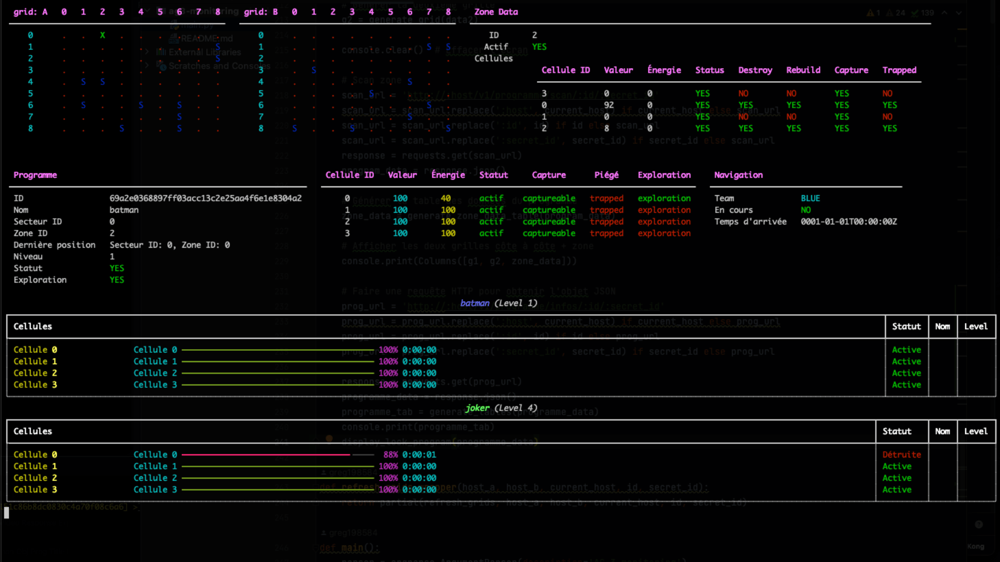

# ag3-monitoring
monitoring AG-3

use with client-ag3

https://github.com/greg198584/client-ag3

## Usage exemple

```bash
> $ python3 -m venv .env 
source .env/bin/activate
pip install -r requirements.txt
```

```bash
> $ python3 main.py --id your_id --secret-id your_secret_id --host_a 195.154.84.18:20180 --host_b 195.154.84.18:20190 --current_host 195.154.84.18:20180
L'ID du programme est 69a2e0368897ff
Le Secret ID est b73c621bf0b699384d9
host: 195.154.84.18:20180
host: 195.154.84.18:20190
current host: 195.154.84.18:20180
```

## Screen exemple


